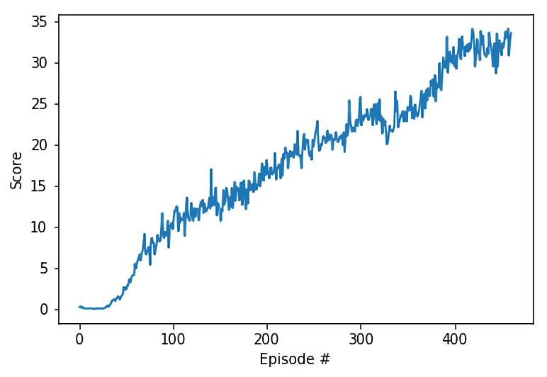

# Project Report


### Environment Details

|                       Structure                        |                             Goal                             |                         Observations                         |
| :----------------------------------------------------: | :----------------------------------------------------------: | :----------------------------------------------------------: |
| Double-jointed arm which can move to target locations. | The agents must move their hands to the goal location, and keep them there. | contain position, rotation, velocity, and angular velocities of the arm |

| Number of Agents | State Size | Agent Action Size | Action Type | Action Value Range |
| :--------------: | :--------: | :---------------: | :---------: | :----------------: |
|        20        |     33     |         4         | Continuous  |      [-1, 1]       |

|                       Reward Function                        |                      Solve Requirements                      |
| :----------------------------------------------------------: | :----------------------------------------------------------: |
| +0.1 for each step that the agent's hand is in the goal location | average score of +30 over 100 consecutive episodes across all agents |


### Learning Algorithm


### Network Architectures

#### Actor

```
Actor(
  (fc1): Linear(in_features=33, out_features=256, bias=True)
  (fc2): Linear(in_features=256, out_features=4, bias=True)
)
```

#### Critic

```
Critic(
  (fcs1): Linear(in_features=33, out_features=256, bias=True)
  (fc2): Linear(in_features=260, out_features=256, bias=True)
  (fc3): Linear(in_features=256, out_features=128, bias=True)
  (fc4): Linear(in_features=128, out_features=1, bias=True)
)
```


### Chosen Hyper-Parameters

| Hyper-Parameters  | Description                                           |  Default   |
| ----------------- | ----------------------------------------------------- | :--------: |
| `random_seed`     | The random seed                                       |    `10`    |
| `lr_actor`        | Learning rate for the Actor Model                     |   `1e-4`   |
| `lr_critic`       | Learning rate for the Critic Model                    |   `3e-4`   |
| `w_decay`         | L2 weight decay for Critic Model                      |   `1e-5`   |
| `noise`           |                                                       |    `2`     |
| `theta`           |                                                       |   `0.15`   |
| `sigma`           |                                                       |   `0.2`    |
| `noise_reduction` |                                                       |  `0.9999`  |
| `buffer_size`     | The replay memory buffer size                         | `int(1e6)` |
| `batch_size`      | Mini-batch size                                       |   `256`    |
| `gamma`           | Reward discount factor                                |   `0.99`   |
| `tau`             | For soft update of target parameters                  |   `1e-3`   |
| `add_noise`       | Add noise to action space during training             |   `True`   |
| `update_every`    | Time step interval for learning from experiences      |    `4`     |
| `target_avg`      | Average score required to consider environment solved |   `30.0`   |
| `n_episodes`      | Maximum number of episodes to train the models        |   `2000`   |


### Training Results

| Test Bed         |                                  |
| ---------------- | -------------------------------- |
| Operating System | Ubuntu 18.04.1 LTS 64-bit        |
| Processor        | i7-6700K                         |
| Memory           | 16 GB                            |
| Graphics         | GTX 1070 (NVIDIA Driver: 396.54) |

| Episodes to Solve |   Training Time    | Average Score |
| :---------------: | :----------------: | :-----------: |
|        360        | 1 hour 30 min 19 s |     30.1      |



### Ideas for Future Work

* Further fine-tuning of hyper-parameters would be an easy (if time consuming) way to further improve the agent's performance. This could lead to a lower number of episodes needed to solve, reduced training time, or improved consistency in the agents performance.
* Changing the number of updates to the agent per time step could potentially reduce the number of episodes required.
* Wall clock training time could be significantly reduced by parallelizing calculations for the 20 agents in the environment.